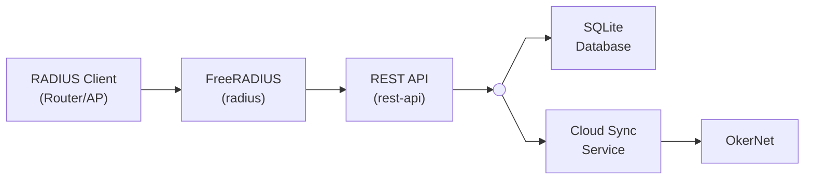

# Radius Proxy

An on-premises RADIUS authentication server that integrates with OkerNet Cloud. Provides local RADIUS authentication with cloud synchronization for user management, supporting offline operation when cloud connectivity is unavailable.

## Features

- **RADIUS Authentication**: PAP, CHAP, and MS-CHAPv2 support via FreeRADIUS
- **Cloud Sync**: Automatic synchronization with OkerNet Cloud for user and device management
- **Offline Operation**: Local SQLite database ensures authentication continues during cloud outages
- **Accounting**: RADIUS accounting with batch upload to cloud
- **Docker Deployment**: Simple deployment with Docker Compose

## Docker Images

Pre-built Docker images are available on Docker Hub:

| Image | Description | Pull Command |
|-------|-------------|--------------|
| [okernet/radius-proxy](https://hub.docker.com/r/okernet/radius-proxy) | REST API server (NestJS) | `docker pull okernet/radius-proxy` |
| [okernet/radius](https://hub.docker.com/r/okernet/radius) | FreeRADIUS server | `docker pull okernet/radius` |

**Supported Architectures:** `linux/amd64`, `linux/arm64`

**Tags:**
- `latest` - Latest stable release
- `x.y.z` - Specific version (e.g., `1.0.0`)

## Quick Start (Production)

### 1. Download the Docker Compose file

```bash
curl -O https://raw.githubusercontent.com/okernet/radius-proxy/refs/heads/main/docker-compose.prod.yml
```

### 2. Create an environment file

Create a `.env` file with your configuration:

```bash
# App Configuration
PORT=3080
HOST=0.0.0.0
LOG_LEVEL=info

# OIDC Auth (obtain from OkerNet Cloud provisioning)
OIDC_ISSUER=https://id.okernet.com/realms/okernet
OIDC_CLIENT_ID=radius-proxy-<tenant-id>
OIDC_CLIENT_SECRET=<secret-from-provisioning>

# Cloud Connection
CLOUD_API_URL=https://api.okernet.net
CLOUD_TIMEOUT_MS=10000

# Sync Settings
SYNC_INTERVAL_MS=60000
ACCOUNTING_UPLOAD_INTERVAL_MS=10000
ACCOUNTING_BATCH_SIZE=100

# Database
DB_PATH=./data/radius-proxy.sqlite

# Security - Generate secure random strings for these
RADIUS_API_KEY=<your-secure-api-key>
RADIUS_CLIENT_SECRET=<your-radius-shared-secret>
```

### 3. Start the services

```bash
docker compose -f docker-compose.prod.yml up -d
```

The RADIUS server will be available on:
- **Authentication**: UDP port 1812
- **Accounting**: UDP port 1813
- **REST API**: TCP port 3080

## RADIUS Client Integration

### MikroTik Router Configuration

Configure your MikroTik router to use this RADIUS server:

```routeros
# Add RADIUS server
/radius
add address=<radius-server-ip> secret=<RADIUS_CLIENT_SECRET> service=hotspot,login,ppp

# Configure Hotspot to use RADIUS
/ip hotspot profile
set default radius-default-domain="" use-radius=yes
```

### General RADIUS Client Setup

For any RADIUS client (access points, routers, VPN concentrators):

| Setting | Value |
|---------|-------|
| Server IP | Your radius-proxy host IP |
| Authentication Port | 1812 (UDP) |
| Accounting Port | 1813 (UDP) |
| Shared Secret | Value of `RADIUS_CLIENT_SECRET` from `.env` |
| Protocol | PAP, CHAP, or MS-CHAPv2 |

## Development Setup

### Prerequisites

- Node.js 24+
- Docker and Docker Compose

### 1. Clone the repository

```bash
git clone https://github.com/okernet/radius-proxy.git
cd radius-proxy
```

### 2. Install dependencies

```bash
npm install
```

### 3. Configure environment

```bash
cp .env.example .env
# Edit .env with your development settings
```

### 4. Start the development environment

```bash
docker compose -f docker-compose.dev.yml up
```

This starts:
- REST API with hot-reload on port 3080
- FreeRADIUS server with debug logging on ports 1812/1813

### Available Scripts

| Script | Description |
|--------|-------------|
| `npm run dev` | Start development server with hot-reload |
| `npm run build` | Build for production |
| `npm run start:prod` | Run production build |
| `npm run lint` | Run ESLint |
| `npm run test` | Run unit tests |
| `npm run test:e2e` | Run end-to-end tests |

## Environment Variables

| Variable | Description | Default |
|----------|-------------|---------|
| `PORT` | REST API port | `3080` |
| `HOST` | REST API bind address | `0.0.0.0` |
| `LOG_LEVEL` | Logging level (debug, info, warn, error) | `info` |
| `OIDC_ISSUER` | OIDC issuer URL for cloud auth | - |
| `OIDC_CLIENT_ID` | OIDC client ID | - |
| `OIDC_CLIENT_SECRET` | OIDC client secret | - |
| `CLOUD_API_URL` | OkerNet Cloud API URL | - |
| `CLOUD_TIMEOUT_MS` | Cloud API timeout in milliseconds | `10000` |
| `SYNC_INTERVAL_MS` | User sync interval in milliseconds | `60000` |
| `ACCOUNTING_UPLOAD_INTERVAL_MS` | Accounting upload interval | `10000` |
| `ACCOUNTING_BATCH_SIZE` | Max records per accounting upload | `100` |
| `DB_PATH` | SQLite database path | `./data/radius-proxy.sqlite` |
| `RADIUS_API_KEY` | API key for FreeRADIUS to REST API auth | - |
| `RADIUS_CLIENT_SECRET` | Shared secret for RADIUS clients | - |

## Architecture Overview



**Components:**

- **FreeRADIUS**: Handles RADIUS protocol, delegates authentication to REST API
- **REST API**: NestJS application managing auth logic, local database, and cloud sync
- **SQLite Database**: Local cache of users/devices for offline operation
- **Cloud Sync**: Periodic synchronization of users and devices from OkerNet Cloud
- **Accounting Upload**: Batch upload of RADIUS accounting records to the cloud

## License

This project is licensed under the GNU General Public License v3.0 - see the [LICENSE](LICENSE) file for details.

For information about third-party software used in this project, see [SOURCE.md](SOURCE.md).
